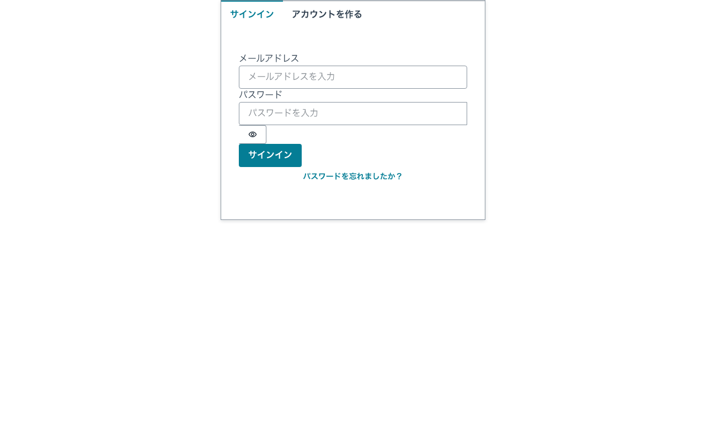
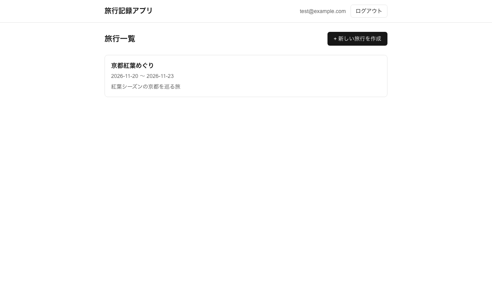
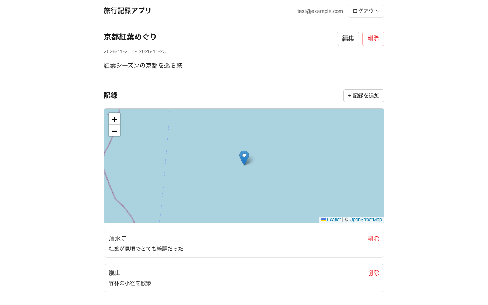
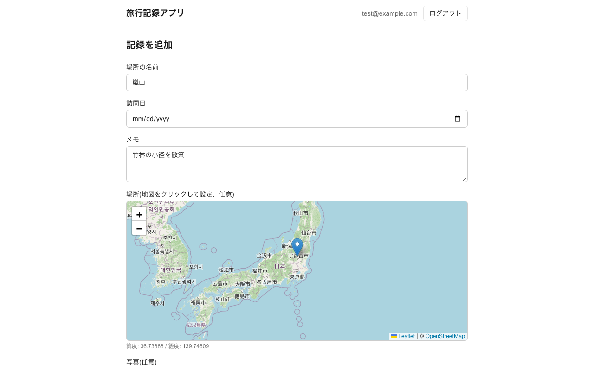

# 旅行記録アプリ(travel-log-app)

訪れた場所・日付・メモ・写真を旅行ごとに記録できるWebアプリ。

## スクリーンショット

| サインイン | 旅行一覧 |
|---|---|
|  |  |

| 旅行詳細(記録一覧+地図) | 記録追加(地図クリックで位置設定) |
|---|---|
|  |  |

## 技術スタック

- [Next.js](https://nextjs.org)(App Router, TypeScript)
- [AWS Amplify Gen 2](https://docs.amplify.aws/) — バックエンド定義をコードで管理
  - 認証: Amazon Cognito
  - データ: AppSync + DynamoDB(Amplify Data)
  - ストレージ: S3(旅行写真の保存)
- [react-leaflet](https://react-leaflet.js.org/) + OpenStreetMap — 地図表示(APIキー不要)
- デプロイ: [AWS Amplify Hosting](https://docs.aws.amazon.com/amplify/latest/userguide/welcome.html)(GitHub連携でCI/CD)

## ローカル開発

前提: Node.js 20.9以上、AWSアカウントとIAM認証情報(`aws configure`済み)。

1. 依存関係をインストール

   ```bash
   npm install
   ```

2. Amplifyのクラウドサンドボックスを起動(個人用のバックエンドをAWS上に構築し、
   ローカルのフロントエンドから接続できるようにする)

   ```bash
   npx ampx sandbox
   ```

   起動すると`amplify_outputs.json`が生成される(gitignore対象)。

3. 別ターミナルで開発サーバーを起動

   ```bash
   npm run dev
   ```

   [http://localhost:3000](http://localhost:3000) で確認できる。

## デプロイ(AWS Amplify Hosting)

ビルド仕様は`amplify.yml`に定義済み(バックエンド: `ampx pipeline-deploy`、
フロントエンド: `next build`)。

1. このリポジトリをGitHubにpushする(このリポジトリは既にpush済み)
2. [AWS Amplifyコンソール](https://console.aws.amazon.com/amplify/)を開く
3. 「新しいアプリケーションを作成」→「GitHubアプリケーションをホスト」を選択し、
   GitHubアカウントを認可してこのリポジトリ(`kiyota7/travel-log-app`)とブランチ(`main`)を選択
4. ビルド設定は`amplify.yml`が自動検出されるのでそのまま「次へ」
5. 「保存してデプロイ」でビルドが開始される(バックエンド・フロントエンド両方で数分かかる)
6. デプロイ完了後に発行されるURL(`https://<branch>.<app-id>.amplifyapp.com`)でアプリを確認できる

### 再デプロイ

`main`ブランチにpushするたびに、Amplify Hostingが自動でビルド・再デプロイする。

## ディレクトリ構成

- `app/` — Next.js App Routerのページ・レイアウト
- `components/` — 共通UIコンポーネント(地図・カード等)
- `amplify/` — Amplify Gen2バックエンド定義(認証・データ・ストレージ)
